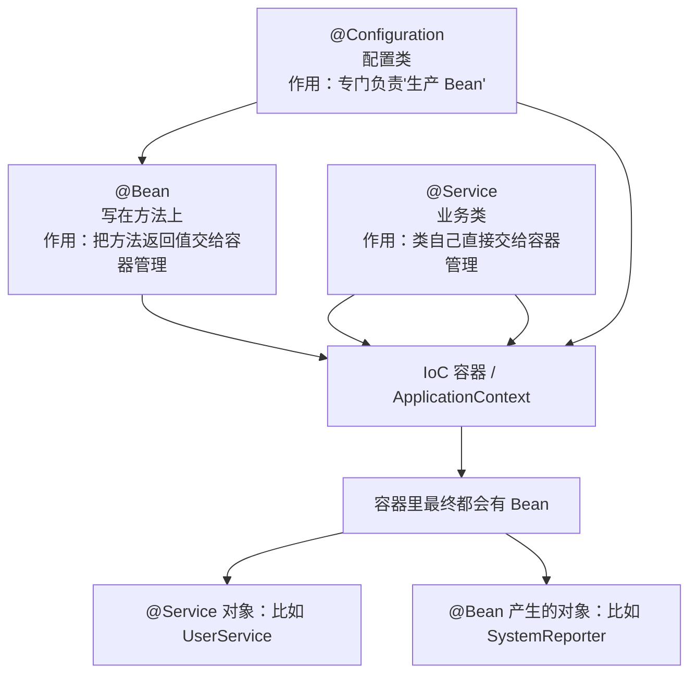
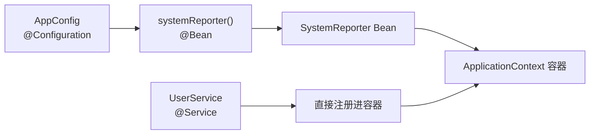
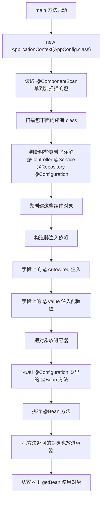

# Spring Core 白话笔记

这份笔记是配合当前这个小项目看的。

目标很简单：

- 用最白话的话，搞懂 `@Configuration`、`@Bean`、`@Service`
- 看懂容器启动时到底做了什么
- 把“扫描、创建、注入、注册”这条主线串起来

---

## 1. `@Configuration` 为什么会有

`@Configuration` 说白了就是：

“这个类不是普通业务类，它是专门用来生产 Bean 的配置类。”

### 它和 `@Service`、`@Controller`、`@Repository` 的区别

`@Controller`、`@Service`、`@Repository` 这类注解，重点是：

“这个类自己要交给容器管理。”

比如：

- `UserController` 自己是一个 Bean
- `UserService` 自己是一个 Bean
- `UserRepository` 自己也是一个 Bean

而 `@Configuration` 不太一样。

它更像一个“Bean 工厂说明书”。

意思是：

“这个类主要不是自己干业务，而是负责告诉容器，还要额外创建哪些对象。”

所以 `@Configuration` 经常和 `@Bean` 一起出现。

对应源码：

- `@Configuration` 注解定义：`src/main/java/com/zimu/spring/annotation/Configuration.java`
- `@Bean` 注解定义：`src/main/java/com/zimu/spring/annotation/Bean.java`
- `@Service` 注解定义：`src/main/java/com/zimu/spring/annotation/Service.java`
- 配置类示例：`src/main/java/com/zimu/demo/config/AppConfig.java`
- 业务类示例：`src/main/java/com/zimu/demo/service/UserService.java`

### 最简单记忆法

- `@Service`：这个类自己上班
- `@Configuration`：这个类负责安排谁上班
- `@Bean`：把某个方法返回的对象也安排上班

---

## 2. `@Configuration`、`@Bean`、`@Service` 三者关系图

### 白话解释

这张图想表达的其实就一句话：

进容器有两条常见路。

第一条路：

类自己身上带了 `@Service`、`@Controller`、`@Repository`，那它自己直接进容器。

第二条路：

类本身也许没加这些组件注解，但它是 `@Configuration` 类里的 `@Bean` 方法返回出来的对象，那它也能进容器。

所以最后结果是一样的：

不管你是“类自己注册”，还是“配置类帮你注册”，最后都会变成容器里的 Bean。

对应源码：

- 容器识别哪些类算组件：`src/main/java/com/zimu/spring/context/ApplicationContext.java`
- `@Configuration` 配置类：`src/main/java/com/zimu/demo/config/AppConfig.java`
- `@Service` 业务类：`src/main/java/com/zimu/demo/service/UserService.java`
- `@Bean` 产生的普通对象：`src/main/java/com/zimu/demo/bean/SystemReporter.java`

---

## 3. 你这个项目里的真实关系

### 白话解释

在你现在这个项目里：

- `UserService` 是因为自己标了 `@Service`，所以直接被容器管理
- `SystemReporter` 是一个普通类，它不是靠 `@Service` 进去的
- 它是靠 `AppConfig` 里的 `@Bean` 方法返回出来，然后再放进容器

也就是说：

`@Service` 走的是“类直接注册”路线。

`@Bean` 走的是“方法返回对象注册”路线。

对应源码：

- `AppConfig` 里定义了 `@Bean` 方法：`src/main/java/com/zimu/demo/config/AppConfig.java`
- `UserService` 自己标了 `@Service`：`src/main/java/com/zimu/demo/service/UserService.java`
- `SystemReporter` 是被 `@Bean` 注册进去的普通类：`src/main/java/com/zimu/demo/bean/SystemReporter.java`

---

## 4. 容器启动流程图

### 白话解释

你可以把容器启动理解成一家公司招人入职。

#### 第一步：先看去哪招人

容器先读取 `@ComponentScan`。

意思就是先确定：

“我要去哪个包下面找候选人。”

对应源码：

- 启动入口：`src/main/java/com/zimu/Main.java`
- 配置类上的 `@ComponentScan`：`src/main/java/com/zimu/demo/config/AppConfig.java`
- 容器解析扫描包：`src/main/java/com/zimu/spring/context/ApplicationContext.java`

#### 第二步：把候选人名单找出来

容器会扫描这个包下的所有类。

也就是先把所有可能用得上的 class 全部找出来。

对应源码：

- 包扫描工具：`src/main/java/com/zimu/spring/util/ClassScanner.java`
- 容器发起扫描：`src/main/java/com/zimu/spring/context/ApplicationContext.java`

#### 第三步：挑出真正要管理的人

不是所有类都要交给容器。

只有带这些注解的类，才会被当成组件：

- `@Controller`
- `@Service`
- `@Repository`
- `@Configuration`

对应源码：

- 容器判断组件类型：`src/main/java/com/zimu/spring/context/ApplicationContext.java`
- 控制层示例：`src/main/java/com/zimu/demo/controller/UserController.java`
- 业务层示例：`src/main/java/com/zimu/demo/service/UserService.java`
- 持久层示例：`src/main/java/com/zimu/demo/repository/UserRepository.java`
- 配置类示例：`src/main/java/com/zimu/demo/config/AppConfig.java`

#### 第四步：开始创建对象

容器开始 `new` 这些类。

但不是瞎 new。

它会先看构造器里需要什么参数，再把这些参数对应的对象也准备好。

这一步其实就是依赖注入。

对应源码：

- 容器创建 Bean：`src/main/java/com/zimu/spring/context/ApplicationContext.java`
- `UserService` 构造器注入 `UserRepository`：`src/main/java/com/zimu/demo/service/UserService.java`

#### 第五步：处理 `@Autowired`

对象创建出来后，如果字段上写了 `@Autowired`，容器就会继续找对应类型的 Bean 塞进去。

比如：

`UserController` 里需要 `UserService`，那容器就把 `UserService` 放进去。

对应源码：

- `@Autowired` 字段注入逻辑：`src/main/java/com/zimu/spring/context/ApplicationContext.java`
- `UserController` 中的 `@Autowired` 字段：`src/main/java/com/zimu/demo/controller/UserController.java`

#### 第六步：处理 `@Value`

然后容器再看字段上有没有 `@Value`。

如果有，就去 `application.properties` 里拿值。

比如：

- 端口号
- 数据库名字
- 应用名
- 版本号

对应源码：

- `@Value` 注入逻辑：`src/main/java/com/zimu/spring/context/ApplicationContext.java`
- `UserController` 里的端口示例：`src/main/java/com/zimu/demo/controller/UserController.java`
- `UserRepository` 里的数据库名示例：`src/main/java/com/zimu/demo/repository/UserRepository.java`

#### 第七步：注册进容器

等这个对象依赖也齐了，配置值也填好了，它才算真正准备完毕。

然后容器把它放进自己的大仓库里保存起来。

以后谁要用，直接拿。

对应源码：

- Bean 注册和获取：`src/main/java/com/zimu/spring/context/ApplicationContext.java`

#### 第八步：处理 `@Configuration + @Bean`

前面创建完组件类后，容器还会专门去看：

“哪些类是配置类？”

找到 `@Configuration` 类后，再去执行里面标了 `@Bean` 的方法。

这些方法返回出来的普通对象，也会被放进容器。

对应源码：

- 容器处理 `@Bean` 方法：`src/main/java/com/zimu/spring/context/ApplicationContext.java`
- 配置类里的 `@Bean`：`src/main/java/com/zimu/demo/config/AppConfig.java`
- 被注册的普通类：`src/main/java/com/zimu/demo/bean/SystemReporter.java`

#### 第九步：真正开始使用

最后，业务代码通过 `getBean()` 从容器里拿对象。

一拿出来，通常已经是一个“依赖都装好了、配置也填好了”的完整对象。

对应源码：

- 启动后 `getBean()` 使用对象：`src/main/java/com/zimu/Main.java`
- 容器里的 `getBean()` 方法：`src/main/java/com/zimu/spring/context/ApplicationContext.java`

---

## 5. 一句话总总结

Spring 容器启动，本质上就是做这几件事：

1. 找类
2. 创建对象
3. 注入依赖
4. 注入配置
5. 放进容器统一管理

所以你以后再看到 Spring，脑子里可以先只记一句话：

“Spring 就是在帮我们统一创建对象、组装对象、管理对象。”

建议对照阅读顺序：

1. 先看 `src/main/java/com/zimu/Main.java`
2. 再看 `src/main/java/com/zimu/demo/config/AppConfig.java`
3. 再看 `src/main/java/com/zimu/spring/context/ApplicationContext.java`
4. 然后看 `src/main/java/com/zimu/spring/util/ClassScanner.java`
5. 最后回头看 `controller`、`service`、`repository` 三层业务类

---

## 6. 再用一句人话记住它

你可以把 Spring 容器想成一个“大总务部”：

- 它负责招人
- 它负责安排工位
- 它负责发设备
- 它负责分配同事
- 你真正干活时，不需要自己一个个去找人
- 直接向总务部要就行

这就是 IoC 容器最核心的味道。
