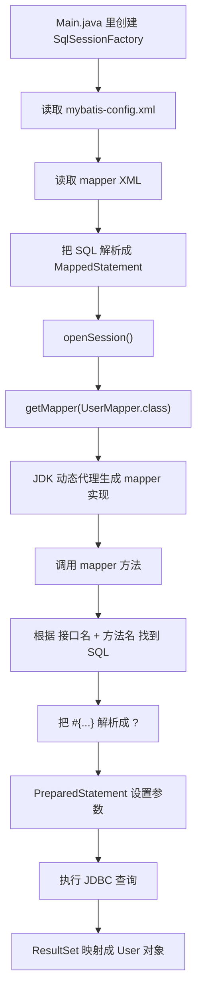

# mini MyBatis 学习笔记

这份文档不是在讲真正完整的 MyBatis 源码。

它的目标是：

- 帮你先把 MyBatis 最核心的骨架看懂
- 用你已经知道一点的 JDBC 当跳板
- 让你知道 MyBatis 到底比 JDBC 多帮你做了什么
- 顺手把几个特别容易混淆的概念讲清楚

---

## 1. 先用一句人话理解 MyBatis

如果只用 JDBC，你通常要自己做这些事：

1. 自己写连接代码
2. 自己写 SQL
3. 自己把 `?` 参数一个个塞进去
4. 自己从 `ResultSet` 里一列一列取值
5. 自己手动拼成 Java 对象

MyBatis 本质上就是：

“帮你把 JDBC 里重复、机械、容易写烦的部分，包装起来。”

所以你可以先记住一句话：

MyBatis 的底层还是 JDBC。

它不是不用 JDBC。

它只是把 JDBC 的使用过程“组织起来了”。

---

## 2. 你现在这个 mini MyBatis 做了什么

这次我们自己手写的版本，故意只保留最核心主线：

1. 读取总配置文件 `mybatis-config.xml`
2. 读取 `mapper.xml`
3. 把 XML 里的 SQL 解析成 Java 里的配置对象
4. 通过动态代理生成 `UserMapper` 的实现对象
5. 调用接口方法时，自动找到对应 SQL
6. 把 `#{}` 变成 JDBC 的 `?`
7. 用 `PreparedStatement` 设置参数
8. 执行查询
9. 把结果集自动映射成 Java 对象

所以这个 mini 版本，虽然很小，但是已经把 MyBatis 最重要的“味道”搭出来了。

---

## 3. 这套代码的执行流程

可以先看这张图：



白话理解：

- 你写的是接口
- 你没有写真正实现类
- 代理对象会在运行时偷偷帮你实现
- 你一调用接口方法，它就去找 XML 里的 SQL
- 然后底层还是走 JDBC 去查数据库
- 最后再把结果变成 Java 对象返回给你

---

## 4. 这几个类分别是干什么的

### 4.1 `SqlSessionFactoryBuilder`

这个类负责：

“根据配置文件，造出一个 SqlSessionFactory。”

它像工厂的建造者。

你在 `Main.java` 里第一步就是从这里开始的。

### 4.2 `SqlSessionFactory`

这个类负责：

“生产 SqlSession。”

你可以理解成：

它不直接查数据库，它只是负责产出一个“会话对象”。

### 4.3 `SqlSession`

这个类是 MyBatis 里非常关键的门面对象。

它像一个总入口。

你后面拿 mapper、执行 SQL，通常都要通过它。

### 4.4 `MapperProxy`

这个类负责：

“把接口调用，转成 SQL 调用。”

比如你写了：

```java
User user = userMapper.selectById(1L);
```

看起来像普通 Java 接口调用。

但实际上真正做事的是动态代理。

代理会把它翻译成：

- 当前接口是谁
- 当前方法名是什么
- 去配置里找哪条 SQL
- 然后执行查询

### 4.5 `MappedStatement`

这个类负责：

“保存一条已经解析好的 SQL 配置。”

它里面通常会有这些内容：

- namespace
- id
- sql
- parameterType
- resultType

你可以把它理解成：

“XML 里一条 SQL 的 Java 版身份证。”

### 4.6 `SimpleExecutor`

这个类负责：

“真正用 JDBC 执行 SQL。”

它做的事很像你手写 JDBC 时做的那些流程：

- 建连接
- 预编译 SQL
- 绑定参数
- 执行查询
- 取结果

### 4.7 `ResultSetMapper`

这个类负责：

“把结果集转成 Java 对象。”

这一步很重要。

因为如果没有它，你每次查完库还得自己写：

```java
User user = new User();
user.setId(resultSet.getLong("id"));
user.setUsername(resultSet.getString("username"));
user.setAge(resultSet.getInt("age"));
```

MyBatis 的价值之一，就是帮你少写这种重复代码。

---

## 5. 你最容易模糊的几个概念

## 5.1 什么是 `mapper`

`mapper` 这个词，在 MyBatis 里经常会同时指两样东西：

1. Java 接口，比如 `UserMapper`
2. XML 文件，比如 `UserMapper.xml`

所以很多初学者会混。

你可以这样记：

- Java 接口：面向程序员调用
- XML 文件：面向 SQL 配置

接口负责定义“我要查什么”。

XML 负责定义“这件事对应哪条 SQL”。

---

## 5.2 什么是 `namespace`

在 mapper XML 里，你会看到这样的写法：

```xml
<mapper namespace="com.zimu.demo.mybatis.mapper.UserMapper">
```

这个 `namespace` 本质上就是在说：

“这个 XML 文件是给哪个 mapper 接口服务的。”

在我们的 mini 版本里，约定：

`statementId = namespace + "." + 方法名`

比如：

- `namespace = com.zimu.demo.mybatis.mapper.UserMapper`
- 方法名 = `selectById`

拼起来就是：

`com.zimu.demo.mybatis.mapper.UserMapper.selectById`

这个字符串就是唯一定位一条 SQL 的 key。

---

## 5.3 什么是 `id`

在 XML 里你会写：

```xml
<select id="selectById" ...>
```

这里的 `id`，本质上就是：

“这条 SQL 对应接口里的哪个方法。”

也就是说：

- 接口方法名是 `selectById`
- XML 里的 `id` 也要叫 `selectById`

这样代理对象调用方法时，才能对上。

---

## 5.4 什么是 `parameterType`

它表示：

“这条 SQL 预计接收什么类型的参数。”

比如：

```xml
parameterType="java.lang.Long"
```

说明这条 SQL 准备接收一个 `Long` 参数。

在我们这个 mini 版本里，它主要是帮助你理解配置含义。

真正执行时，参数绑定主要还是根据你传进来的对象去取值。

---

## 5.5 什么是 `resultType`

它表示：

“这条 SQL 查出来后，要装进什么类型的 Java 对象里。”

比如：

```xml
resultType="com.zimu.demo.mybatis.entity.User"
```

意思就是：

这条 SQL 查出来后，要映射成 `User` 对象。

---

## 5.6 什么是 `#{}`，为什么它最后会变成 `?`

你在 XML 里写的是：

```sql
where id = #{id}
```

但 JDBC 真正认识的不是 `#{id}`。

JDBC 真正认识的是：

```sql
where id = ?
```

所以 MyBatis 会帮你做一层转换：

1. 先记住 `id` 这个参数名
2. 再把 SQL 改成 `?`
3. 最后用 `PreparedStatement` 按顺序设置参数值

这也是为什么 MyBatis 本质上还是建立在 JDBC 上。

---

## 6. 什么叫“约定大于配置”

你问到这个特别好，因为这是很多框架都会提的一句话。

“约定大于配置”不是说不要配置。

它真正的意思是：

“先约定一套默认规则，大部分情况下你照着规则来，就不用写那么多额外配置。”

也就是说：

- 不是完全不要配置
- 而是能靠约定解决的，就少写配置

### 举个最简单的例子

在 MyBatis 里，最常见的约定有这些：

1. mapper 接口和 mapper XML 一一对应
2. mapper XML 里的 `namespace` 等于接口全限定名
3. XML 里的 `id` 等于接口方法名
4. 一个方法通常对应一条 SQL

如果你都按这个约定来，那框架就很容易自动帮你匹配上。

如果你不按这个约定来，也不是绝对不行。

只是你就需要额外写更多配置，告诉框架：

“虽然我名字不一样，但你还是要把它们当一对。”

所以“约定大于配置”的本质，是：

先靠统一规则降低沟通成本。

---

## 7. 为什么要在 `resources` 里面放 mapper XML

这个问题特别重要。

先说结论：

因为 mapper XML 不是 Java 源码。

它属于“资源文件”。

而 Java 项目里，资源文件通常放在 `src/main/resources` 下面。

### 7.1 什么叫资源文件

资源文件就是：

不是 `.java` 代码，但程序运行时又要读取的文件。

比如：

- `.properties`
- `.xml`
- `.yml`
- 模板文件
- 静态文本

MyBatis 的 mapper XML 就属于这一类。

它不会被 Java 编译器编译成 `.class`。

但程序运行时要从 classpath 里把它读出来。

所以它应该放在 `resources`。

---

## 8. 为什么经常会看到“resources 里建同名 mapper”

这里的“同名”，一般说的是这种习惯：

Java 接口是：

`com.zimu.demo.mybatis.mapper.UserMapper`

那 XML 就常常写成：

`src/main/resources/com/zimu/demo/mybatis/mapper/UserMapper.xml`

你会发现：

- 包路径一样
- 文件名也一样

只有后缀不同：

- 一个是 `.java`
- 一个是 `.xml`

### 8.1 为什么大家喜欢这样放

因为这样最不容易乱。

你一看到接口：

`UserMapper.java`

几乎不用想，就知道它对应的 XML 大概率在：

`resources/com/zimu/demo/mybatis/mapper/UserMapper.xml`

这就是典型的约定大于配置。

### 8.2 这样做的好处

1. 好找
2. 好记
3. 不容易配错
4. 团队协作时别人也容易看懂

### 8.3 是不是必须同名

不是绝对必须。

重点不是“必须同名”，而是“必须能对应上”。

真正关键的是这些关系要对：

1. XML 文件能被加载到
2. XML 里的 `namespace` 要对
3. `id` 要能对上接口方法名

只是因为“同名 + 同路径”最好维护，所以大家几乎都会这么做。

---

## 9. 为什么 XML 里写 SQL，而不是直接写在接口里

这个问题也很常见。

你可以从“职责分离”理解：

- Java 接口负责定义行为
- XML 负责定义 SQL 细节

这样做的好处是：

1. Java 代码和 SQL 分开，结构更清晰
2. SQL 比较长时，不会把 Java 代码搞得很乱
3. DBA 或偏 SQL 的同学改 SQL 更方便
4. 动态 SQL 在 XML 里更好组织

当然，真正 MyBatis 里也支持注解方式写 SQL。

但 XML 方式在复杂 SQL 场景里非常常见。

---

## 10. 预编译配置到底是什么，为什么老说 `PreparedStatement`

你提到“为什么有预编译这种说法”，这里我详细说一下。

### 10.1 什么叫预编译

预编译，说白了就是：

SQL 模板先固定下来，参数后面再填进去。

比如这条 SQL：

```sql
select id, username, age from t_user where id = ?
```

这里 SQL 结构先定好了。

真正变化的只有参数值。

这就叫预编译思想。

### 10.2 为什么不用字符串拼接

如果你自己拼字符串，可能会这样写：

```java
String sql = "select * from t_user where id = " + id;
```

这有几个问题：

1. 容易写得乱
2. 不方便复用
3. 更重要的是容易有 SQL 注入风险

而 `PreparedStatement` 的写法是：

```java
String sql = "select * from t_user where id = ?";
PreparedStatement ps = connection.prepareStatement(sql);
ps.setLong(1, id);
```

这种写法更安全，也更规范。

### 10.3 MyBatis 和预编译是什么关系

MyBatis 里你写的是：

```sql
where id = #{id}
```

但它底层会帮你转成：

```sql
where id = ?
```

然后再调用：

```java
preparedStatement.setObject(1, 参数值);
```

所以本质上，MyBatis 是在帮你更方便地使用 `PreparedStatement`。

它并不是绕开了预编译。

它恰恰是在拥抱预编译。

---

## 10.4 `#{username}`、`#{password}` 这种到底是怎么解析的

你现在看到这种 XML：

```xml
<insert id="insertUser" parameterType="com.zimu.demo.mybatis.entity.User">
    insert into t_user(username, password, age)
    values (#{username}, #{password}, #{age})
</insert>
```

最容易迷糊的点通常有两个：

1. `#{username}` 为什么最后会变成 `?`
2. `username` 这个值到底是从哪里拿出来的

### 第一步：先把 `#{...}` 变成 JDBC 的 `?`

在我们这个 mini MyBatis 里，这一步是 `GenericTokenParser.parse(...)` 做的。

比如原始 SQL 是：

```sql
insert into t_user(username, password, age)
values (#{username}, #{password}, #{age})
```

解析后会变成：

```sql
insert into t_user(username, password, age)
values (?, ?, ?)
```

同时它还会记住参数顺序：

```text
[username, password, age]
```

也就是说，框架不是只改 SQL。

它还会顺手记住：

第 1 个问号对应 `username`

第 2 个问号对应 `password`

第 3 个问号对应 `age`

### 第二步：再去参数对象里按名字取值

假设你传进去的是这个对象：

```java
User user = new User();
user.setUsername("wangwu");
user.setPassword("pw123");
user.setAge(22);
```

那框架就会按刚才记住的顺序去取值：

1. 看到 `username`，就去 `user` 对象里找 `username` 字段
2. 看到 `password`，就去 `user` 对象里找 `password` 字段
3. 看到 `age`，就去 `user` 对象里找 `age` 字段

最后拿到的是：

```text
username -> wangwu
password -> pw123
age -> 22
```

### 第三步：把这些值按顺序塞进 `PreparedStatement`

最后底层会做的事，本质上就是：

```java
preparedStatement.setObject(1, "wangwu");
preparedStatement.setObject(2, "pw123");
preparedStatement.setObject(3, 22);
```

所以你可以把 `#{username}` 理解成一句人话：

“等下请从参数对象里把 `username` 这个字段取出来，然后安全地绑定到 SQL 里。”

### 你可以怎么记

`#{字段名}` 不是直接把字符串拼到 SQL 里。

它做的是两件事：

1. 记住字段名
2. 最后把字段值安全地绑定到 `?` 上

### 本项目对应代码

- `#{...}` 解析成 `?`：`src/main/java/com/zimu/mybatis/util/GenericTokenParser.java`
- 按字段名从对象中取值：`src/main/java/com/zimu/mybatis/reflection/ParameterResolver.java`
- 最终绑定到 `PreparedStatement`：`src/main/java/com/zimu/mybatis/executor/SimpleExecutor.java`
- 演示类：`src/main/java/com/zimu/demo/mybatis/support/PlaceholderBindingDemo.java`
- 真实 insert XML：`src/main/resources/com/zimu/demo/mybatis/mapper/UserMapper.xml`

---

## 11. mini MyBatis 和真实 MyBatis 的差距

我们这次做的是学习版，所以故意只保留主线。

真实 MyBatis 远比这个复杂。

真正的 MyBatis 还会处理很多事情，比如：

1. 一级缓存
2. 二级缓存
3. 插件机制
4. 动态 SQL
5. `#{}` 和 `${}` 的区别
6. `resultMap`
7. 多参数绑定
8. 类型处理器 `TypeHandler`
9. 事务管理
10. 延迟加载

所以你现在不要追求一下子全懂。

只要先把这条主线吃透，就已经很好了：

接口调用 -> 找到 SQL -> 参数绑定 -> JDBC 查询 -> 返回对象

---

## 12. 你应该按什么顺序看代码

建议按这个顺序看：

1. `src/main/java/com/zimu/Main.java`
2. `src/main/resources/mybatis-config.xml`
3. `src/main/resources/com/zimu/demo/mybatis/mapper/UserMapper.xml`
4. `src/main/java/com/zimu/demo/mybatis/mapper/UserMapper.java`
5. `src/main/java/com/zimu/mybatis/session/SqlSessionFactoryBuilder.java`
6. `src/main/java/com/zimu/mybatis/builder/XmlConfigBuilder.java`
7. `src/main/java/com/zimu/mybatis/builder/XmlMapperBuilder.java`
8. `src/main/java/com/zimu/mybatis/session/DefaultSqlSession.java`
9. `src/main/java/com/zimu/mybatis/binding/MapperProxy.java`
10. `src/main/java/com/zimu/mybatis/executor/SimpleExecutor.java`
11. `src/main/java/com/zimu/mybatis/reflection/ResultSetMapper.java`

这样你会比较容易从“外面怎么用”，一路看到“里面怎么实现”。

---

## 13. 这次你可以重点记住的 8 句话

1. MyBatis 底层还是 JDBC。
2. `SqlSessionFactory` 是工厂，`SqlSession` 是会话入口。
3. mapper 接口通常没有实现类，实现靠动态代理。
4. mapper XML 负责保存 SQL 配置。
5. `namespace + id` 可以唯一定位一条 SQL。
6. `#{}` 最终会变成 JDBC 的 `?`。
7. `PreparedStatement` 是预编译 SQL 的核心。
8. “resources 放 mapper XML”是因为 XML 属于运行时资源文件，不是 Java 源码。

---

## 14. 如果你接下来继续学，建议按这个节奏走

下一步你最值得继续学的是：

1. `#{}` 和 `${}` 的区别
2. 多参数怎么传
3. `resultMap` 是怎么解决字段名和属性名不一致的
4. 动态 SQL 为什么那么重要
5. MyBatis 和 Spring 是怎么整合的

如果你愿意，我下一步可以继续在这个 mini 版本上，帮你加上：

- `insert`
- `update`
- `delete`
- `${}` 演示
- `resultMap` 的最小实现
